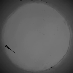
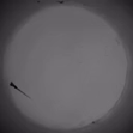
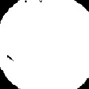
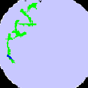

# Zebrafish Movement Tracker

This project calculates information about how much zebrafish move in petri dishes, using top-down videos of them.

## Requirements

#### Python and dependencies
This tool uses Python 3.13, and may have limited compatibility with other versions.

To install the required packages that Python uses in this project, run: `pip intall -r requirements.txt`

#### FFmpeg
FFmpeg is a video processing utility that is used in this project for compression. It has a Python package that will be installed with the requirements file, but needs an executable to be installed separately and added to your `PATH` environment variable before the Python package will work. 
- FFmpeg releases can be found on the [official FFmpeg website](https://www.ffmpeg.org/download.html)
- The exact process for adding FFmpeg to path varies by operating system.

#### Videos

This tool requires top-down .mp4 videos of zebrafish in petri dishes:
- It can only accurately track videos with one zebrafish
- It relies on the zebrafish being significantly darker than the background
- It relies on all of the videos processed at the same time having the same general layout.
    - If you have different batches of videos that have different coloring, you may need to process one batch at a time to verify that the fish is being tracked properly. If you are concerned about this, run `python visualize_movement.py` after a batch of videos are processed to show every video's data, and press `q` to skip through the videos.

## Tutorial

1. Copy the videos that you want to be analyzed to the `source_videos` folder.
2. Run the movement tracking script `python movement_tracking.py`
2.a. The video preview at the end shows how the fish was tracked in one video: light blue is the dish, green is the travel path of the fish, and dark blue is the fish on that frame.
2.b. Make sure that the video shown only tracks your zebrafish and not random noise in the dish. Alter the parameters in `movement_tracking.py` if necessary until only the places the fish goes are tracked as green.
3. Generate statistics about the travel path of every processed video by running `python generate_statistics.py`. The results will be created in the `results` folder.

## Image Samples
The following is the first frame of a video in various parts of processing:

1. The original image

2. The image compressed to a smaller size

3. The compressed image with binary coloring

4. The binary image with overlays of the tracking data
